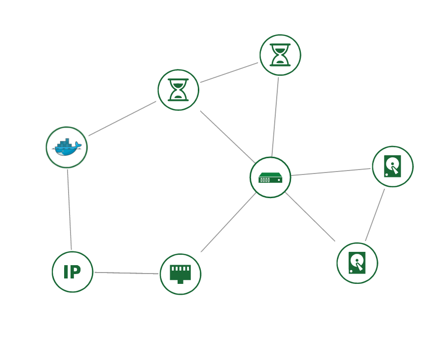

# Docker plugin

Docker containers and VMs by just one stack definition , all together in the mix

## Requirements

This templates require the [heat contrib extension for docker containers](https://github.com/openstack/heat/tree/master/contrib/heat_docker)
