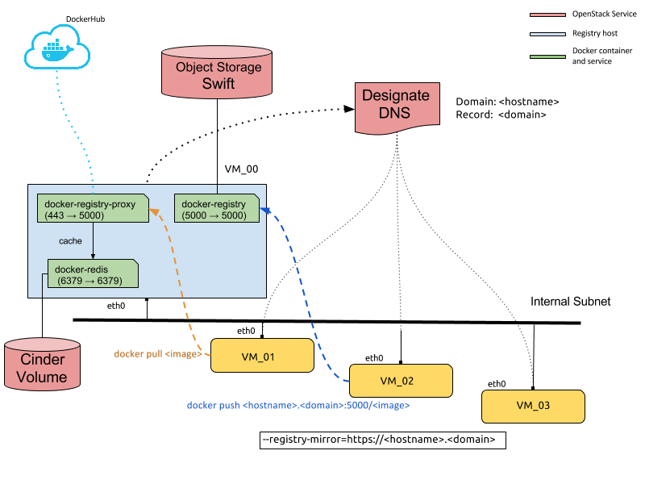
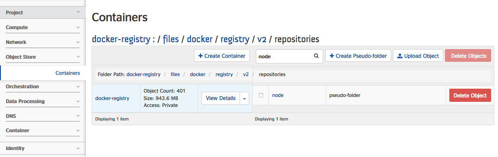

# Docker Registry and Proxy

Within this stack template we could deploy a docker host as docker registry and proxy at once.



In the docker host we'll have three services running : 

* docker-redis : Default proxy cache storage (Redis by default). 
* docker-registry : The docker registry (Swift as default storage)
* docker-registry-proxy: The docker registry runs as pull through cache

## Creating the stack

To create a stack from this template, we should know the defaults and optional values.

By default the needed parameters are (see descriptions of them [in file](heat_registry_docker-yaml) ): 

  - hostname
  - domain
  - server_key
  - server_flavor
  - server_image: At the moment we are basing on CoreOS.
  - fip_network: Floating IPs network.
  - os_username
  - os_password
  - os_region
  - os_authurl

Let's create a stack by typing params in commnad line :

```
$ heat stack-create -f heat_registry_proxy -P hostname=myhost -P domain=mydomain.com -P server_key=mykey
-P server_flavor=m1.small -P server_image=CoreOS -P fip_network="pool-1" -P os_username=engapa
-P os_password=xxxxx -P os_region=Spain_Mad -P os_authurl=https://identity:5000/v2 docker_registry
```

We prefer to use environment files to specify params, in this case the command would be like this:

```
$ heat stack-create -e env_params.yml -f heat_registry_proxy.yml docker_registry
```

Where the contents of env file is :

```
parameters:
  hostname: myhost
  domain: mydomain.com
  server_key: mykey
  server_flavor: m1.small
  server_image: CoreOS
  fip_network: pool-1
  os_username: engapa
  os_password: xxxxx
  os_region: Spain_Mad
  os_authurl: https://identity:5000/v2
```

Once stack is ready ca.crt and key files are available at <code>/home/root/registry_certs/</code> .

## Use pre-defined certificates

If you have your own crt and key files then put then in directory <code>/home/root/registry_certs/</code> replacing auto-generated ones before.
To apply certificate changes restart services : 

```
# systemctl restart docker-registry
# systemctl restart docker-registry-proxy
```

Also we could change the cloud-config file to remove service **gen-cert-key** and add two "write_files" entries for your key and crt files.

## Configure docker registry clients:

If you want to use a registry as a pull through cache then you have to add this option to docker service (daemon) : 

```
--registry-mirror=https://<docker-registry-host>
```

And finally, before restart, add the ca.crt file to *<code>/etc/docker/certs.d/\<docker-registry-host\></code>* and *<code>/etc/docker/certs.d/\<docker-registry-host\>:5000</code>* directories.

To verify everything work fine let's try to do a pull of an image from two docker host configured as we said before (suppose that our registry is docker-registry.eurocloud.es):

```
registry-client2 ~ # time docker pull node
Using default tag: latest
latest: Pulling from library/node
...
Digest: sha256:d375100a63e67658f2b7420c56910d2bcc1ba0f1ae7b769e4a54db07a6c6a763
Status: Downloaded newer image for node:latest

real	2m8.628s
user	0m0.099s
sys	0m0.029s

registry-client2 ~ # curl -k https://docker-registry.eurocloud.es/v2/_catalog
{"repositories":["library/node"]}
```

From other docker host :
```
registry-client3 ~ # time docker pull node
Using default tag: latest
latest: Pulling from library/node
...
Digest: sha256:d375100a63e67658f2b7420c56910d2bcc1ba0f1ae7b769e4a54db07a6c6a763
Status: Downloaded newer image for node:latest

real	0m23.878s
user	0m0.057s
sys	0m0.045s
``` 

Now we're going to do a push to our registry:  

```
registry-client3 ~ # docker login docker-registry.eurocloud.es:5000
Username: engapa
Password:
Email:
WARNING: login credentials saved in /root/.docker/config.json
Login Succeeded
registry-client3 ~ # docker tag node docker-registry.eurocloud.es:5000/node
registry-client3 ~ # docker push docker-registry.eurocloud.es:5000/node


```

This image can be found by Swift panel at Horizon (Openstack dashboard) for instance : 



## Requirements

You need a openstack swift account , in other case feel free to change the [config file](files/coreos/cloud-config.yaml).

## TODO

Use Designate resource of heat to add a record with <code>\<hostname\>.\<domain\></code>