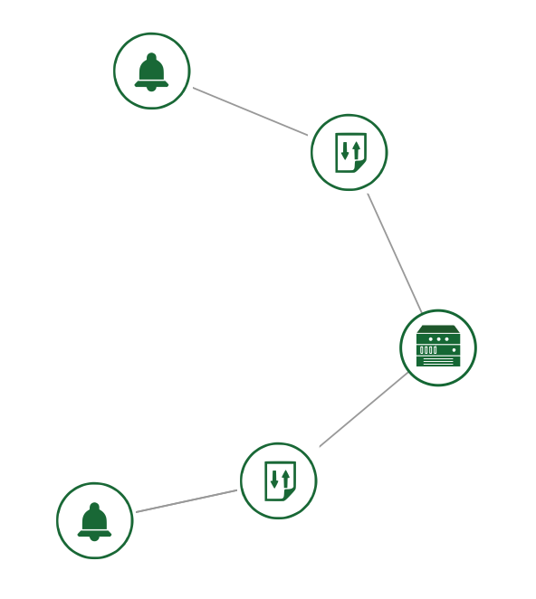

# Scaling groups

Here we have examples about scaling features.



Create a stack by typing following command:

```
heat stack-create -e env.yml -f scale_down_up_vm_cpu.yml scale_stack
```

In **server.yaml** change commented lines to stress the cpu and raise alarm signs,
 or enter into vm and chose how to stress it to verify scaling features.

## Requirements

Ensure that ceilometer service is enabled and you have the required roles for your user and tenants in Openstack.
